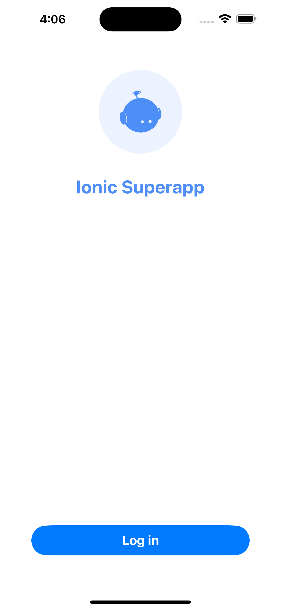
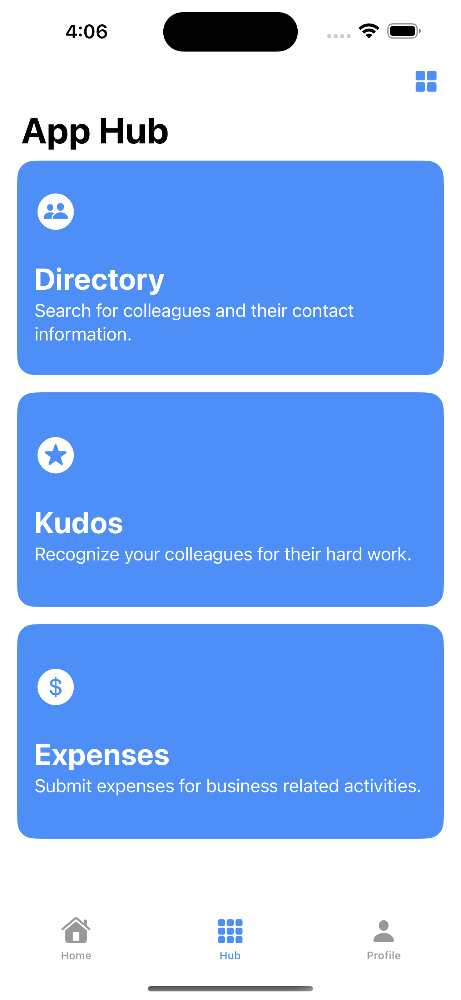
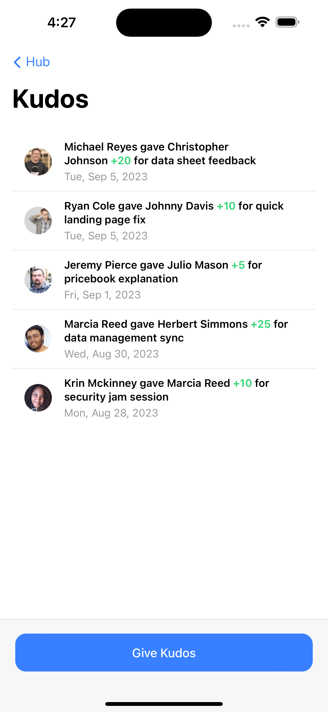

# Ionic Superapp Starter

A showcase app of Ionic's Superapp SDK which includes the following technologies:
- [Ionic Framework](https://ionicframework.com)
- [Capacitor](https://capacitorjs.com)
- [Appflow](https://ionic.io/appflow)
- [Portals](https://ionic.io/portals)

|  |  | 
|:---:|:---:|
| [Login View](https://github.com/ionic-team/superapp-starter/blob/main/ios%20(complete)/Superapp%20Starter/Login/LoginView.swift) | [Hub View](https://github.com/ionic-team/superapp-starter/blob/main/ios%20(complete)/Superapp%20Starter/Hub/HubView.swift) |
|  |  | 
| [Mini App View](https://github.com/ionic-team/superapp-starter/blob/main/ios%20(complete)/Superapp%20Starter/Hub/MiniApp/MiniAppView.swift) | Superapp Demo |


## How to Run
> Note: Running the iOS app requires an [Ionic Portals Key](https://ionic.io/docs/portals/getting-started#using-your-product-key).

Go into each web app directory starting with `data` and `npm install` them. Run `npm run build` for the Employee Directory, Expenses, and Kudos apps:

```bash
cd web/
cd data && npm install && cd ..
```

```bash
cd directory && npm install && npm run build && cd ..
cd expenses && npm install && npm run build && cd ..
cd kudos && npm install && npm run build && cd ..
```

Once built, the mini apps will be pulled into the iOS project automatically (via the Run Script) when the native superapps are built.

## Auth Info

To log into the **completed** Ionic Superapp Starter, use the following credentials when prompted with the Auth0 login page:
| username | password | role(s) |
|------- | -------- | ------ |
| user@superapp.com | ionic | contractor
| manager@superapp.com | ionic | manager, sales 
| admin@superapp.com | ionic | admin, sales

## Tutorial

Want to see how the Ionic Superapp Starter was made? [Follow along the step-by-step tutorial](https://ionic.io/docs/superapp-starter).

## Tech Details

iOS Core App:
- SwiftUI
- Portals

Mini Apps:
- Ionic Framework 7
- Capacitor 5
- Vue 3 (Directory)
- Angular 16 (Expenses)
- React 18 (Kudos)
