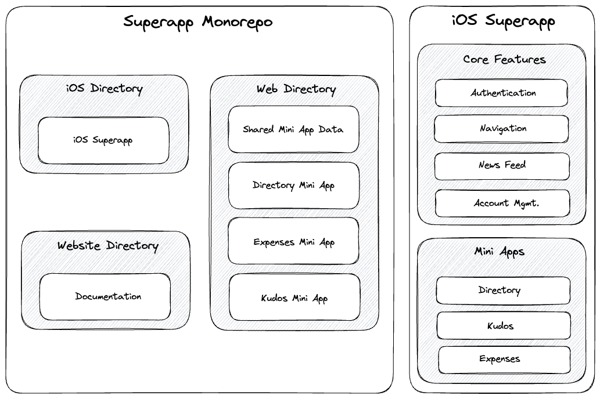

# Superapp architecture

The main components of a superapp are the core application and the mini applications that live and are accessible within the host.

The hosting app controls the core features like authentication, navigation, and any other features and functions that are best served from the native layer (ie, payments). The mini apps housed in the hosting app work to make available additional features that benefit the authenticated user. Additionally, the mini apps inherit the authentication from the superapp. Thus, all future API requests from the mini apps are sent from the user who originally logged in on the native layer.

## Diagram

## Monorepo

For our superapp, we opted to use a monorepo setup. It's important to emphasize that this is a strategic choice and not a strict requirement. However, at Ionic we've found that this setup, especially for tutorials, has proved helpful.

A monorepo greatly simplifies dependency management. It also works to improve code sharing and reusability across the project. One can imagine many cases in which web code could effectively be shared across multiple mini apps. With a monorepo, this is a breeze.
