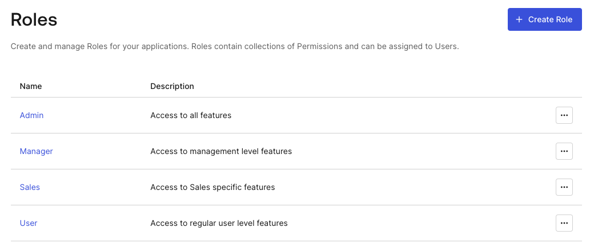

# Toggle mini app visibility based on user role

A massive advantage for superapps is that all of the services a user may need to complete their task are available to them in one app. However, if their are specific mini apps that house features the authenticated shouldn't have access too or would not need to have access too, this is added noise. To keep the user experience as streamlined as possible, we can have an associated role(s) for the user and then toggle which mini apps are visible based on those role(s).

## Add roles in Auth0

Within your [Auth0 Dashboard], you can establish Roles. These Roles can have associated Permissions for the users that they are assigned too. In this superapp demo, we have four roles: **Admin, Manager, Sales, and User**.



As one can imagine, these roles have varying degrees of permissions. However, for this example we'll look at the _Sales_ role. Within the complete superapp we mentioned the **Expenses** mini app. In our case, only users with the _Sales_ role associated to their account should be able to access the **Expenses** mini app. So, with the _Sales_ role added to the **Admin** and **Manager** accounts, they will be able to see this mini app. For the **User** account, the mini app will not be available.

:::note

For more information on adding **Roles**, [check out the Auth0 docs](https://auth0.com/docs/manage-users/access-control/configure-core-rbac/roles/create-roles).

:::

## Include roles within the ID token

Toggling visibility of the mini apps requires knowing which roles the authenticated user has. This is made possible a few ways. One way is to make a secondary request to Auth0's Management API. Another way, is to add a custom claim to the user's ID Token. This adds a new property to the ID Token that we're already accessing and simplifies things for this tutorial.

To add the custom claim we need to customize the Login Flow. We do so with an Action. To create the post-login action flow, visit [Actions > Flow > Login](https://manage.auth0.com/dashboard/us/ionicorg/actions/flows/login/) within the Auth0 Dashboard. Once there, you'll click "+" next to **Add Action**. Choose the "Build Custom" option. Then give it a name and ensure the trigger is set to "Login / Post Login".

Now, we can [modify the `onExecutePostLogin` function](https://auth0.com/docs/customize/actions/flows-and-triggers/login-flow#add-user-roles-to-id-and-access-tokens) to add user details to the ID Token.

```ts
exports.onExecutePostLogin = async (event, api) => {
  const namespace = 'https://ionic.io/superapp-starer';
  if (event.authorization) {
    api.idToken.setCustomClaim(`${namespace}/roles`, event.authorization.roles);
  }
};
```

You can see that we've established a `namespace` with does not include `auth0.com`. **This is very important, otherwise the custom claim will not pass through on the API response.** Then, after checking for authorization, a custom claim is set using `/roles` with the `namespace` prefix. The associated roles of the authorized user are then passed as the value.

Now, when the user logs in and we need to see what their roles are, we can access them from the decoded ID Token under the `https://ionic.io/superapp-starer/roles` custom claim.

:::note

For more in-depth instructions on creating **Actions**, [visit the Auth0 docs](https://auth0.com/docs/customize/actions/write-your-first-action#create-an-action).

:::

## Modify Profile for roles

With roles added to the ID Token, we can pull those out and store within the `Profile` object. We'll start by adding the `roles` string array property to the `struct`.

```diff title="ios/Superapp Starter/Model/Profile.swift"
  struct Profile: Identifiable, Codable {
    let id: String
    let name: String
    let email: String
    let emailVerified: String
    let picture: String
    let updatedAt: String
+   var roles: Array<String>
  }
```

Next, we'll update the `empty` function to set `roles` as a zero-length array.

```diff title="ios/Superapp Starter/Model/Profile.swift"
  extension Profile {


    static var empty: Self {
      return Profile(
        id: "",
        name: "",
        email: "",
        emailVerified: "",
        picture: "",
-       updatedAt: ""
+       updatedAt: "",
+       roles: []
      )
    }


    static func from(_ idToken: String) -> Self { ... }
}
```

Then, to make things simpler for changes to the `from` function we can quickly add a utility function in a new file which can grab values from the `Auth0.plist`. The custom namespace we outlined in the Action is something we'd likely want to extract for later use. So, we can store that value in the propery list and access it later via this new function.

```swift title="ios/Superapp Starter/Extensions/Utilities.swift"
import Foundation

func auth0Plist() -> [String: Any]? {
  guard let path = Bundle.main.path(forResource: "Auth0", ofType: "plist")
  else {
    print("Missing Auth0.plist file!")
    return nil
  }

  return NSDictionary(contentsOfFile: path) as? [String: Any]
}
```

With that in place, let's update the `from` function to use the utility function and grab the `roles` from the `idToken`.

```diff title="ios/Superapp Starter/Model/Profile.swift"
  extension Profile {


    static var empty: Self { ... }


    static func from(_ idToken: String) -> Self {
      guard
+       let namespace = auth0Plist()?["Namespace"],
        let jwt = try? decode(jwt: idToken),
        let id = jwt.subject,
        let name = jwt.claim(name: "name").string,
        let email = jwt.claim(name: "email").string,
        let emailVerified = jwt.claim(name: "email_verified").boolean,
        let picture = jwt.claim(name: "picture").string,
-       let updatedAt = jwt.claim(name: "updated_at").string
+       let updatedAt = jwt.claim(name: "updated_at").string,
+       let roles = jwt.claim(name: "\(namespace)/roles").array
      else {
        return .empty
      }

      return Profile(
        id: id,
        name: name,
        email: email,
        emailVerified: String(describing: emailVerified),
        picture: picture,
-       updatedAt: updatedAt
+       updatedAt: updatedAt,
+       roles: roles
      )
    }
}
```

## Update the Hub

With the `HubView` in charge of displaying the mini apps we need to update some code here as well. Since we need access to the user's role, we'll add an instance of the `AuthViewModel`. Also, we'll update `apps` to have the `@State` property wrapper. This is becuase now the value here could change from what is default.

```diff title="ios/Superapp Starter/Hub/HubView.swift"
  struct HubView: View {
+   @EnvironmentObject var auth: AuthViewModel

-   private let apps: [MiniApp] = [
+   @State private var apps: [MiniApp] = [
      ...
    ]

    @State private var isMultiColumn: Bool = false

    private var numberColumns: [GridItem] {
      Array(repeating: GridItem(.flexible()), count: isMultiColumn ? 2 : 1)
    }

    var body: some View { ... }
  }
```

Finally, we'll add logic within the `body` when the view appears within `.onAppear`. We'll use the `auth` instance to check if the user's role **doesn't** contains _Sales_. If that's the case, we'll remove the **Expenses** mini app as a possible mini app for the user to see within the `apps` array.

```swift title="ios/Superapp Starter/Hub/HubView.swift"
import SwiftUI

struct HubView: View {
  @EnvironmentObject var auth: AuthViewModel

  @State private var apps: [MiniApp] = [
    MiniApp(
      id: "directory",
      name: "Directory",
      icon: "person.2.circle.fill",
      description: "Search for colleagues and their contact information."
    ),
    MiniApp(
      id: "kudos",
      name: "Kudos", icon: "star.circle.fill",
      description: "Recognize your colleagues for their hard work."
    ),
    MiniApp(
      id: "expenses",
      name: "Expenses",
      icon: "dollarsign.circle.fill",
      description: "Submit expenses for business related activities."
    )
  ]

  @State private var isMultiColumn: Bool = false

  private var numberColumns: [GridItem] {
    Array(repeating: GridItem(.flexible()), count: isMultiColumn ? 2 : 1)
  }

  var body: some View {
    NavigationView {
      ScrollView { ... }
      .padding(.horizontal, 16)
      .navigationTitle("App Hub")
      .toolbar { ... }
    }
    .onAppear {
      if (!auth.userProfile.roles.contains("Sales")) {
        if let expId = apps.firstIndex(where: {$0.id == "expenses"}) {
            apps.remove(at: expId)
        }
      }
    }
  }
}
```

Now, we have a `HubView` that is truly customized to the authenticated user. No noise!
